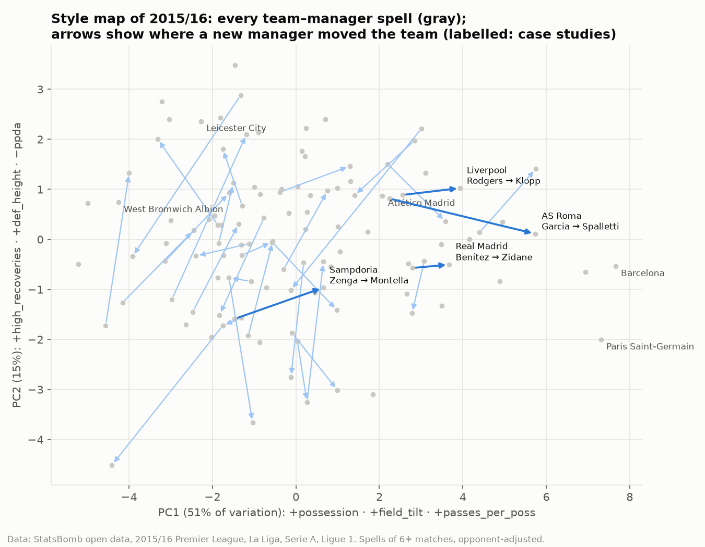
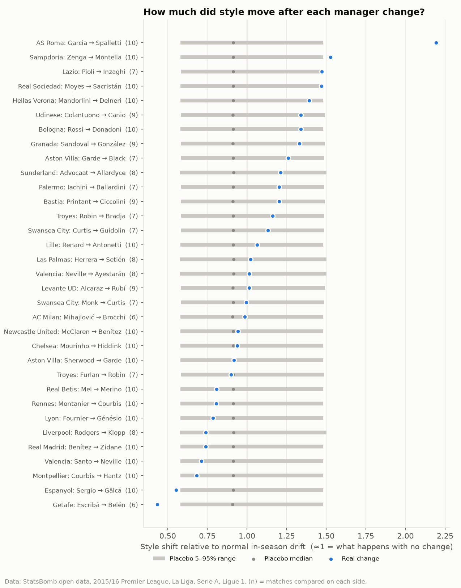
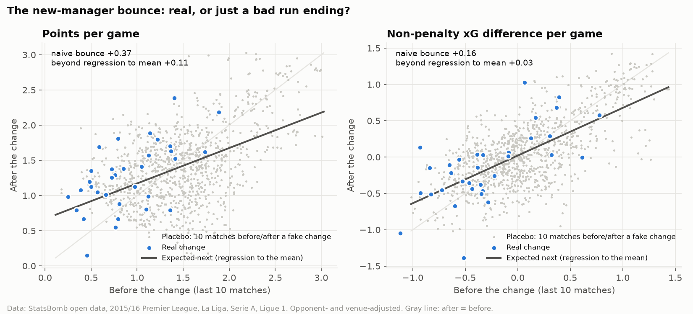
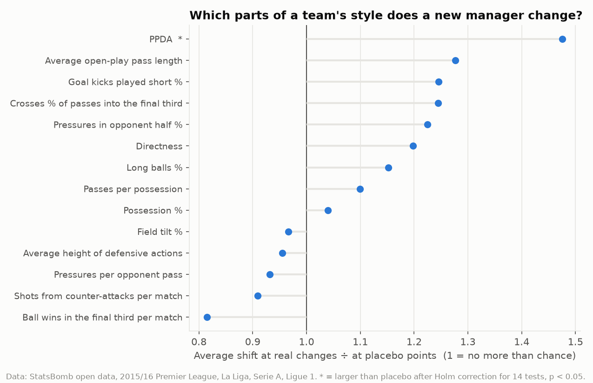
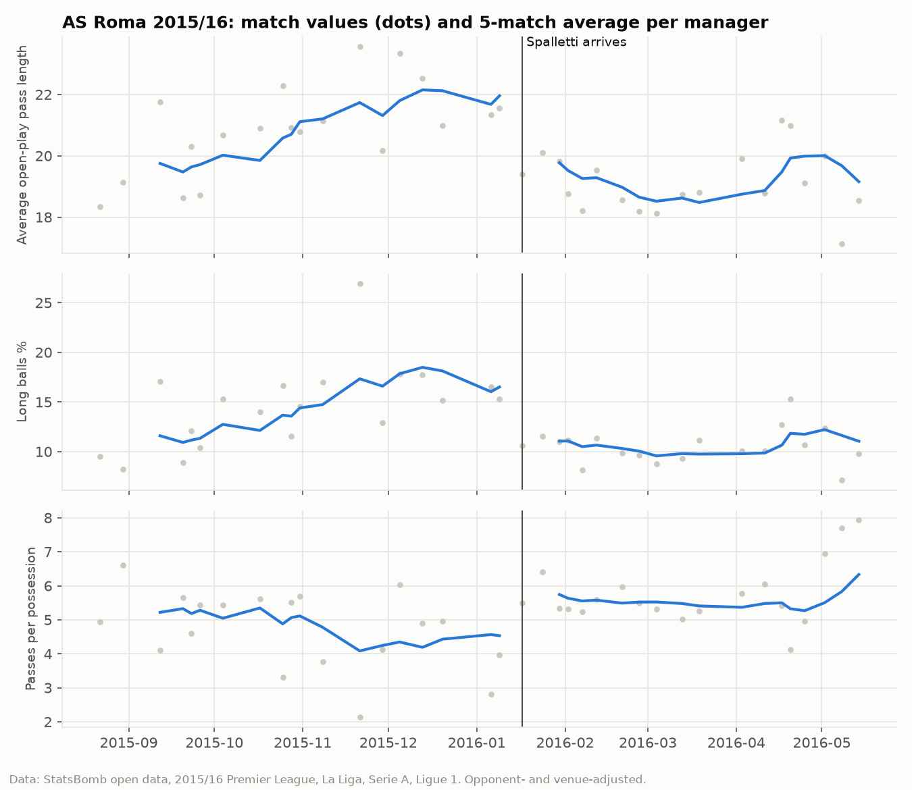

# Does a new manager change how a team plays?

**A natural experiment with 33 mid-season manager changes in Europe's big leagues, 2015/16**

Clubs sack managers mid-season expecting two things: a different style and better
results. This project measures both with StatsBomb event data (every pass, press and shot) from all 1,517 matches
of the 2015/16 Premier League, La Liga, Serie A and Ligue 1. Each real change is compared
with *placebo* change points: the same before/after comparison made mid-spell at clubs
that kept their manager.



## Findings

1. **Most new managers barely change the style, at least at first.** Across 33 changes,
   style moved **1.11×** as much as it drifts anyway during a season (permutation
   p = 0.02). The effect is real but small. Only 2 of 33 changes (6%) moved style more
   than 95% of placebo points, about what chance alone would produce.
2. **The exception proves it can be done.** Spalletti at Roma is the one unambiguous
   style change, at the 99.9th percentile of placebo shifts. Within weeks, Roma's passes
   got shorter (−2.6 between-team SDs), long balls dropped (−2.8) and possessions got
   longer (+1.4). Montella at Sampdoria (96th percentile) is the only other change above
   the placebo band.
3. **Pressing is the dial new managers turn.** PPDA is the only one of 14 metrics that
   moves more at real changes than at placebo points after correcting for multiple
   testing (1.48×, Holm-adjusted p = 0.02). The average direction is ≈0, so managers turn
   the press **up or down**, and there's no general "new manager = more pressing" rule.
4. **The "new manager bounce" is mostly a bad run ending.** Points per game rise by
   **+0.37** after a change, but teams in equally bad runs that *kept* their manager
   recover almost as much. Only **+0.11** ppg (95% CI −0.04 to +0.24) is left beyond
   regression to the mean, and on xG it is **+0.03** (CI −0.10 to +0.16).
5. **Even Klopp's early Liverpool looks like drift in the numbers.** Pressures per
   opponent pass rose from about 0.32 to about 0.40, and possession and field tilt went
   up. That's the direction you'd expect, but with 8 matches either side the total shift
   sits at the 23rd percentile of placebo shifts. Short windows are noisy, so "no
   detectable change" is not the same as "no change".

| | |
|---|---|
|  |  |
|  |  |

Full tables: [`results/report.md`](results/report.md).

**Interactive version:** [`web/style_map.html`](web/style_map.html) is a clickable style map.
Hover a spell, switch the axes to any of the 14 metrics, filter by league, and open any
change to see its before/after profile, shift percentile and bounce. Open it in a browser
(it loads D3 from cdnjs), or serve the repo with GitHub Pages.
Regenerate its data with `python scripts/export_web_data.py`.

## Three traps, and how the design avoids them

1. **Style depends on the opponent.** Everyone has less of the ball against Barcelona, so
   a manager who inherits a tough run of fixtures looks more "defensive". Every metric is
   **opponent- and venue-adjusted**: per league, fit `metric ~ team + opponent + home`
   and subtract the opponent and home parts.
2. **Teams drift anyway.** Injuries, form and fixture congestion move a team's numbers
   during a season, so a before/after difference means little on its own. Each real
   change is compared with **placebo change points**: every point inside an unchanged
   spell with the same number of matches on each side (6–10). The null distribution of
   the average shift draws one matched placebo per real change, 10,000 times.
3. **Sackings follow bad runs, and bad runs end.** A naive before/after comparison of
   results credits the new manager with regression to the mean. The placebo points give
   the expected recovery for *any* team after a run that bad (the fitted post-vs-pre
   line), and only the excess counts as a bounce.

## Data and metrics

[StatsBomb open data](https://github.com/statsbomb/open-data), 2015/16: 1,517 matches,
80 teams, 118 manager spells. Manager names come from StatsBomb's match records.
Caretakers with ≤ 3 matches are dropped, so Mourinho → Holland (1 match) → Hiddink counts
as one change. A change qualifies when both managers have at least 6 matches, which
leaves 33.

14 style metrics per team per match, computed from raw events in
[`coachstyle/features.py`](coachstyle/features.py):

| With the ball | Without the ball | Transition |
|---|---|---|
| possession %, field tilt, passes per possession, pass length, long-ball %, directness, short goal kicks %, crosses % | PPDA, pressures per opponent pass, pressures in opponent half %, height of defensive actions, final-third ball wins | shots from counter-attacks |

Metrics are scaled in **between-team SDs**: a shift of 1.0 is as big as the typical
style gap between two teams in these leagues.

### A note on the test statistic (read this)

My first summary of the 14-metric shift was the plain root-mean-square in between-team
SDs. It found nothing (ratio 1.02, p = 0.34). Looking at why, I found that noisy metrics
dominate it. Counter-attack shots and final-third ball wins swing by 1.4–1.7 SDs over
10 matches with **no** change at all. The [reliability table](results/report.md#appendix-how-reliable-is-each-metric)
shows a 10-match average of counter-attack shots has a reliability of just 0.19, against
0.9 for passing metrics. So the reported statistic divides each metric's shift by its
placebo SD before taking the RMS, which weighs every metric by how unusual its move is.
**This choice was made after seeing the first result**, so both versions are reported,
and the p = 0.02 should be read with that in mind. The per-metric results (finding 3)
and the bounce (finding 4) don't depend on this choice.

## Limitations

- **One season, 33 changes.** Two case studies of a coach at two clubs (Benítez: Real
  Madrid → Newcastle; Courbis: Montpellier → Rennes) point in opposite directions. See
  section 5 of the report. More seasons would allow a proper "coach vs squad" test.
- **Mid-season changes only.** New managers get little training time and inherit a
  squad they can't change until the transfer window. Summer appointments may change
  style far more.
- **Short windows.** At most 10 matches either side. A slow rebuild (or a slow
  pressing overhaul, as Liverpool's may have been) looks like drift.
- **Event data, not tracking data.** Line height and compactness can only be
  approximated, here by where defensive actions happen.
- Possession is approximated by pass share, not ball-in-play time.

## Reproduce

```bash
pip install -r requirements.txt
python scripts/build_dataset.py   # optional: rebuilds data/team_matches.csv (~10 min, streams ~4.5 GB)
python run_analysis.py            # results/report.md + charts
pytest                            # 10 tests, incl. a synthetic season with known answers
```

`data/team_matches.csv` is committed, so `run_analysis.py` works without downloading.

## Layout

```
coachstyle/statsbomb.py   download matches and events
coachstyle/features.py    events -> 14 style metrics + xG per team per match
coachstyle/spells.py      manager spells, real changes, placebo change points
coachstyle/analysis.py    opponent adjustment, style-shift test, bounce, fingerprints/PCA
coachstyle/plots.py       charts
coachstyle/synthetic.py   fake season with planted effects, for tests
run_analysis.py           everything -> results/
scripts/export_web_data.py  data for the interactive map -> web/style_map_data.js
web/style_map.html        interactive style map (D3)
```

Data: StatsBomb open data, used under the
[StatsBomb public data user agreement](https://github.com/statsbomb/open-data/blob/master/LICENSE.pdf).
