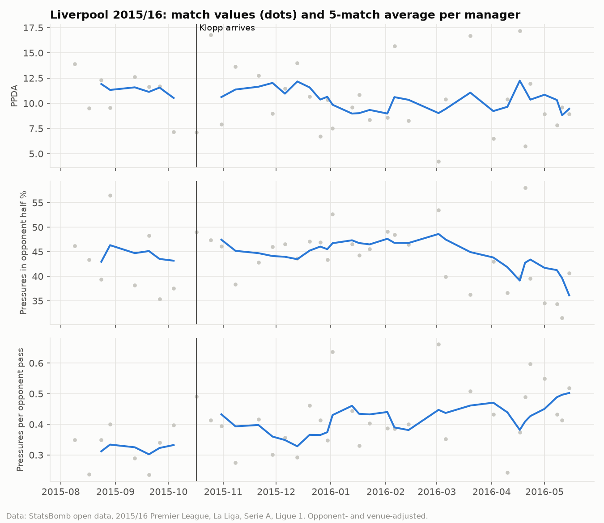

# Does a new manager change how a team plays?

*1517 matches · 80 teams · 118 manager spells · 33 mid-season changes · StatsBomb open data 2015/16*

## Headline numbers

- **Style (test statistic, noise-normalised):** real changes moved style **1.11×** as much as placebo change points (1.07 vs 0.96; permutation p = 0.021).
- **Style (raw, in between-team SDs):** 1.08 vs 1.05 (ratio 1.02, p = 0.344). Noisy metrics dominate this version; see the README.
- 6% of changes moved style more than 95% of placebo change points (5% would by chance).
- **Points bounce:** naive +0.37 ppg (95% CI +0.22 to +0.50); beyond regression to the mean +0.11 (95% CI -0.04 to +0.24).
- **xG bounce:** naive +0.16 xGD/game (95% CI +0.03 to +0.30); beyond regression to the mean +0.03 (95% CI -0.10 to +0.16).

## 1. Style shift at each change

`shift_norm` = RMS over the 14 metrics of (shift ÷ that metric's placebo SD); `shift` = RMS shift in between-team SDs; placebo columns and `percentile` refer to `shift_norm`.

| change                               | date       |   window |   shift_norm |   shift |   placebo_median |   placebo_p95 |   percentile |
|:-------------------------------------|:-----------|---------:|-------------:|--------:|-----------------:|--------------:|-------------:|
| AS Roma: Garcia → Spalletti          | 2016-01-17 |       10 |         2.19 |    1.47 |             0.91 |          1.48 |        99.90 |
| Sampdoria: Zenga → Montella          | 2015-11-22 |       10 |         1.53 |    1.16 |             0.91 |          1.48 |        96.15 |
| Lazio: Pioli → Inzaghi               | 2016-04-10 |        7 |         1.47 |    1.63 |             0.91 |          1.49 |        94.61 |
| Real Sociedad: Moyes → Sacristán     | 2015-11-21 |       10 |         1.47 |    1.31 |             0.91 |          1.48 |        94.47 |
| Hellas Verona: Mandorlini → Delneri  | 2015-12-06 |       10 |         1.39 |    1.61 |             0.91 |          1.48 |        90.72 |
| Udinese: Colantuono → Canio          | 2016-03-20 |        9 |         1.34 |    1.27 |             0.91 |          1.49 |        89.06 |
| Bologna: Rossi → Donadoni            | 2015-11-01 |       10 |         1.34 |    1.07 |             0.91 |          1.48 |        88.25 |
| Granada: Sandoval → González         | 2016-03-14 |        9 |         1.33 |    1.50 |             0.91 |          1.49 |        88.63 |
| Aston Villa: Garde → Black           | 2016-04-02 |        7 |         1.26 |    1.54 |             0.91 |          1.49 |        85.56 |
| Sunderland: Advocaat → Allardyce     | 2015-10-17 |        8 |         1.21 |    1.27 |             0.92 |          1.50 |        82.79 |
| Palermo: Iachini → Ballardini        | 2015-11-22 |        7 |         1.20 |    1.25 |             0.91 |          1.49 |        82.24 |
| Bastia: Printant → Ciccolini         | 2016-01-30 |        9 |         1.20 |    1.23 |             0.91 |          1.49 |        80.77 |
| Troyes: Robin → Bradja               | 2016-02-06 |        7 |         1.16 |    1.31 |             0.91 |          1.49 |        78.58 |
| Swansea City: Curtis → Guidolin      | 2016-01-24 |        7 |         1.13 |    1.24 |             0.91 |          1.49 |        75.52 |
| Lille: Renard → Antonetti            | 2015-11-28 |       10 |         1.06 |    1.11 |             0.91 |          1.48 |        68.51 |
| Las Palmas: Herrera → Setién         | 2015-10-25 |        8 |         1.02 |    0.86 |             0.92 |          1.50 |        64.99 |
| Valencia: Neville → Ayestarán        | 2016-04-02 |        8 |         1.01 |    1.39 |             0.92 |          1.50 |        63.56 |
| Levante UD: Alcaraz → Rubí           | 2015-10-31 |        9 |         1.01 |    1.03 |             0.91 |          1.49 |        64.02 |
| Swansea City: Monk → Curtis          | 2015-12-12 |        7 |         1.00 |    1.13 |             0.91 |          1.49 |        60.68 |
| AC Milan: Mihajlović → Brocchi       | 2016-04-17 |        6 |         0.99 |    0.93 |             0.91 |          1.48 |        61.33 |
| Newcastle United: McClaren → Benítez | 2016-03-14 |       10 |         0.94 |    0.67 |             0.91 |          1.48 |        54.59 |
| Chelsea: Mourinho → Hiddink          | 2015-12-26 |       10 |         0.94 |    1.04 |             0.91 |          1.48 |        53.60 |
| Aston Villa: Sherwood → Garde        | 2015-11-08 |       10 |         0.92 |    1.06 |             0.91 |          1.48 |        50.54 |
| Troyes: Furlan → Robin               | 2015-12-12 |        7 |         0.90 |    0.88 |             0.91 |          1.49 |        48.24 |
| Real Betis: Mel → Merino             | 2016-01-16 |       10 |         0.81 |    0.85 |             0.91 |          1.48 |        34.06 |
| Rennes: Montanier → Courbis          | 2016-01-22 |       10 |         0.81 |    0.95 |             0.91 |          1.48 |        33.96 |
| Lyon: Fournier → Génésio             | 2016-01-09 |       10 |         0.79 |    0.60 |             0.91 |          1.48 |        30.50 |
| Liverpool: Rodgers → Klopp           | 2015-10-17 |        8 |         0.74 |    0.91 |             0.92 |          1.50 |        22.92 |
| Real Madrid: Benítez → Zidane        | 2016-01-09 |       10 |         0.74 |    0.75 |             0.91 |          1.48 |        23.49 |
| Valencia: Santo → Neville            | 2015-12-13 |       10 |         0.71 |    0.70 |             0.91 |          1.48 |        19.94 |
| Montpellier: Courbis → Hantz         | 2016-01-30 |       10 |         0.68 |    0.74 |             0.91 |          1.48 |        16.19 |
| Espanyol: Sergio → Gâlcă             | 2015-12-19 |       10 |         0.55 |    0.55 |             0.91 |          1.48 |         3.36 |
| Getafe: Escribá → Belén              | 2016-04-16 |        6 |         0.44 |    0.48 |             0.91 |          1.48 |         0.24 |

## 2. Which dimensions move

`ratio` = average |shift| at real changes ÷ at placebo points. `mean_signed_shift` is the average direction (in between-team SDs); the placebo 95% band for it is `signed_lo`–`signed_hi`.

| label                                                        |   real_abs_shift |   placebo_abs_shift |   ratio |   p_abs |   p_holm |   mean_signed_shift |   signed_lo |   signed_hi |
|:-------------------------------------------------------------|-----------------:|--------------------:|--------:|--------:|---------:|--------------------:|------------:|------------:|
| PPDA (opp passes per defensive action; LOW = presses harder) |            1.221 |               0.828 |   1.476 |   0.002 |    0.024 |              -0.047 |      -0.517 |       0.204 |
| Average open-play pass length (yd)                           |            0.614 |               0.481 |   1.276 |   0.027 |    0.348 |              -0.056 |      -0.238 |       0.178 |
| Goal kicks played short %                                    |            0.659 |               0.529 |   1.246 |   0.043 |    0.505 |               0.273 |      -0.264 |       0.202 |
| Crosses % of passes into the final third                     |            0.886 |               0.712 |   1.245 |   0.042 |    0.505 |               0.018 |      -0.227 |       0.376 |
| Pressures in opponent half %                                 |            1.098 |               0.896 |   1.225 |   0.045 |    0.505 |               0.305 |      -0.339 |       0.420 |
| Directness (forward yards / pass yards)                      |            0.576 |               0.481 |   1.198 |   0.069 |    0.623 |              -0.039 |      -0.199 |       0.212 |
| Long balls % (35+ yd)                                        |            0.532 |               0.462 |   1.152 |   0.141 |    1.000 |              -0.033 |      -0.170 |       0.235 |
| Passes per possession                                        |            0.466 |               0.424 |   1.099 |   0.237 |    1.000 |               0.102 |      -0.171 |       0.205 |
| Possession % (share of passes)                               |            0.514 |               0.495 |   1.040 |   0.377 |    1.000 |              -0.014 |      -0.189 |       0.255 |
| Field tilt % (share of final-third passes)                   |            0.673 |               0.697 |   0.966 |   0.586 |    1.000 |               0.068 |      -0.290 |       0.310 |
| Average height of defensive actions (yd from own goal)       |            0.959 |               1.004 |   0.955 |   0.627 |    1.000 |               0.120 |      -0.414 |       0.434 |
| Pressures per opponent pass                                  |            0.886 |               0.951 |   0.932 |   0.681 |    1.000 |               0.071 |      -0.108 |       0.682 |
| Shots from counter-attacks per match                         |            1.553 |               1.708 |   0.909 |   0.731 |    1.000 |              -0.052 |      -0.915 |       0.576 |
| Ball wins in the final third per match                       |            1.151 |               1.411 |   0.815 |   0.925 |    1.000 |              -0.223 |      -0.289 |       0.897 |

## 3. The new-manager bounce

| change                               |   pre_pts |   post_pts |   beyond_rtm_pts |   pre_xgd |   post_xgd |   beyond_rtm_xgd |
|:-------------------------------------|----------:|-----------:|-----------------:|----------:|-----------:|-----------------:|
| Lille: Renard → Antonetti            |     +1.05 |      +1.41 |            +0.21 |     -0.09 |      +0.06 |            +0.10 |
| Sunderland: Advocaat → Allardyce     |     +0.38 |      +1.08 |            +0.11 |     -0.92 |      -0.49 |            +0.05 |
| Aston Villa: Sherwood → Garde        |     +0.42 |      +0.67 |            -0.21 |     -0.28 |      -0.62 |            -0.45 |
| Aston Villa: Garde → Black           |     +0.45 |      +0.15 |            -0.88 |     -1.12 |      -1.05 |            -0.42 |
| Swansea City: Monk → Curtis          |     +0.50 |      +1.13 |            +0.08 |     -0.53 |      -0.33 |            -0.04 |
| Swansea City: Curtis → Guidolin      |     +1.13 |      +1.57 |            +0.29 |     -0.33 |      -0.46 |            -0.28 |
| Chelsea: Mourinho → Hiddink          |     +0.79 |      +1.81 |            +0.74 |     +0.17 |      +0.54 |            +0.41 |
| Troyes: Furlan → Robin               |     +0.34 |      +0.79 |            -0.19 |     -0.83 |      -0.51 |            -0.05 |
| Troyes: Robin → Bradja               |     +0.79 |      +0.66 |            -0.50 |     -0.51 |      -1.39 |            -1.10 |
| Rennes: Montanier → Courbis          |     +1.36 |      +1.70 |            +0.35 |     -0.09 |      +0.01 |            +0.05 |
| Bastia: Printant → Ciccolini         |     +1.37 |      +1.63 |            +0.27 |     -0.65 |      -0.11 |            +0.29 |
| Montpellier: Courbis → Hantz         |     +1.74 |      +1.62 |            +0.08 |     +0.61 |      -0.01 |            -0.43 |
| Newcastle United: McClaren → Benítez |     +0.76 |      +1.29 |            +0.24 |     -0.33 |      +0.03 |            +0.23 |
| Liverpool: Rodgers → Klopp           |     +1.41 |      +1.52 |            +0.13 |     +0.37 |      +0.68 |            +0.45 |
| Lyon: Fournier → Génésio             |     +1.14 |      +1.89 |            +0.65 |     +0.07 |      +1.03 |            +0.96 |
| Las Palmas: Herrera → Setién         |     +0.66 |      +1.01 |            -0.06 |     -0.60 |      -0.67 |            -0.32 |
| Lazio: Pioli → Inzaghi               |     +1.22 |      +1.80 |            +0.48 |     +0.13 |      +0.26 |            +0.18 |
| Bologna: Rossi → Donadoni            |     +0.59 |      +1.69 |            +0.73 |     -0.64 |      -0.22 |            +0.18 |
| Real Sociedad: Moyes → Sacristán     |     +0.72 |      +1.25 |            +0.22 |     +0.32 |      +0.03 |            -0.20 |
| Espanyol: Sergio → Gâlcă             |     +0.81 |      +0.88 |            -0.19 |     -0.56 |      -0.03 |            +0.31 |
| Valencia: Santo → Neville            |     +1.36 |      +0.79 |            -0.56 |     -0.38 |      -0.14 |            +0.09 |
| Valencia: Neville → Ayestarán        |     +0.72 |      +1.38 |            +0.27 |     -0.22 |      -0.26 |            -0.13 |
| Getafe: Escribá → Belén              |     +0.50 |      +1.35 |            +0.27 |     -0.93 |      +0.14 |            +0.64 |
| Hellas Verona: Mandorlini → Delneri  |     +0.25 |      +0.98 |            +0.19 |     -0.84 |      -0.15 |            +0.38 |
| AS Roma: Garcia → Spalletti          |     +1.40 |      +2.39 |            +1.01 |     +0.39 |      +0.82 |            +0.55 |
| AC Milan: Mihajlović → Brocchi       |     +0.97 |      +1.12 |            -0.12 |     +0.30 |      +0.29 |            +0.12 |
| Udinese: Colantuono → Canio          |     +0.57 |      +1.05 |            +0.04 |     -0.39 |      +0.04 |            +0.27 |
| Sampdoria: Zenga → Montella          |     +1.10 |      +0.80 |            -0.42 |     -0.35 |      -0.38 |            -0.17 |
| Palermo: Iachini → Ballardini        |     +1.12 |      +0.99 |            -0.30 |     -0.34 |      -0.50 |            -0.32 |
| Levante UD: Alcaraz → Rubí           |     +0.77 |      +0.55 |            -0.54 |     -0.46 |      -0.36 |            -0.08 |
| Real Betis: Mel → Merino             |     +0.85 |      +1.38 |            +0.28 |     -0.44 |      -0.44 |            -0.17 |
| Real Madrid: Benítez → Zidane        |     +1.89 |      +2.18 |            +0.57 |     +0.78 |      +0.58 |            +0.05 |
| Granada: Sandoval → González         |     +0.48 |      +1.20 |            +0.24 |     -0.72 |      -0.45 |            -0.01 |

## 4. Case studies

## 5. Coach or club? Managers seen at two clubs

| manager         | old_club    | new_club         | predecessor                        |   dist_to_own_old_team |   dist_to_predecessor_at_new_club |
|:----------------|:------------|:-----------------|:-----------------------------------|-----------------------:|----------------------------------:|
| Rafael Benítez  | Real Madrid | Newcastle United | Steve McClaren                     |                   1.49 |                              0.83 |
| Rolland Courbis | Montpellier | Rennes           | Philippe Jacques William Montanier |                   0.71 |                              0.89 |

## Appendix: how reliable is each metric?

`share_between` = share of match-level variance that is a stable team difference; `reliability_10` = reliability of a 10-match average.

| label                                                        |   share_between |   reliability_10 |
|:-------------------------------------------------------------|----------------:|-----------------:|
| Passes per possession                                        |            0.50 |             0.91 |
| Average open-play pass length (yd)                           |            0.47 |             0.90 |
| Long balls % (35+ yd)                                        |            0.47 |             0.90 |
| Directness (forward yards / pass yards)                      |            0.46 |             0.90 |
| Possession % (share of passes)                               |            0.40 |             0.87 |
| Goal kicks played short %                                    |            0.34 |             0.84 |
| Field tilt % (share of final-third passes)                   |            0.26 |             0.78 |
| Crosses % of passes into the final third                     |            0.24 |             0.76 |
| PPDA (opp passes per defensive action; LOW = presses harder) |            0.17 |             0.66 |
| Pressures in opponent half %                                 |            0.16 |             0.66 |
| Pressures per opponent pass                                  |            0.15 |             0.65 |
| Average height of defensive actions (yd from own goal)       |            0.14 |             0.62 |
| Ball wins in the final third per match                       |            0.07 |             0.42 |
| Shots from counter-attacks per match                         |            0.02 |             0.19 |
