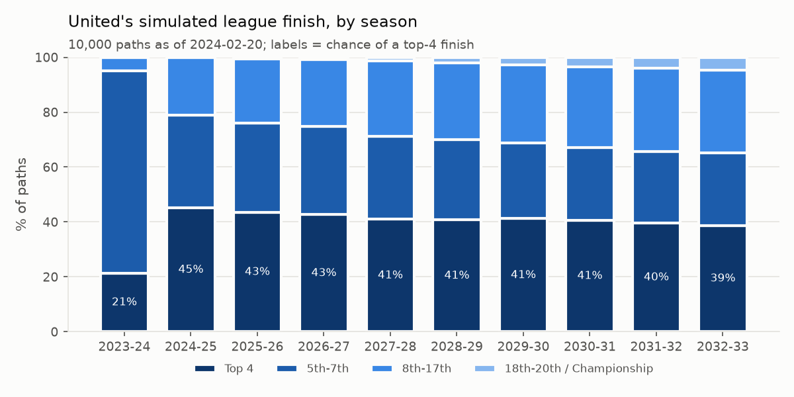
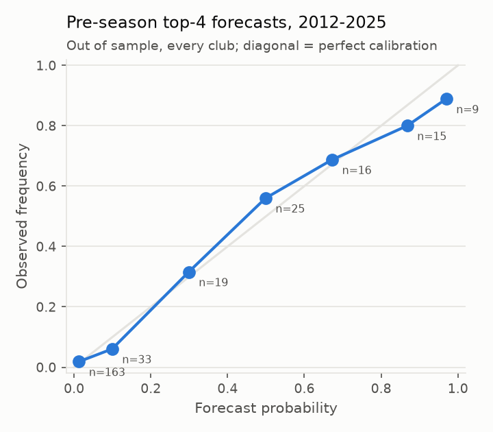
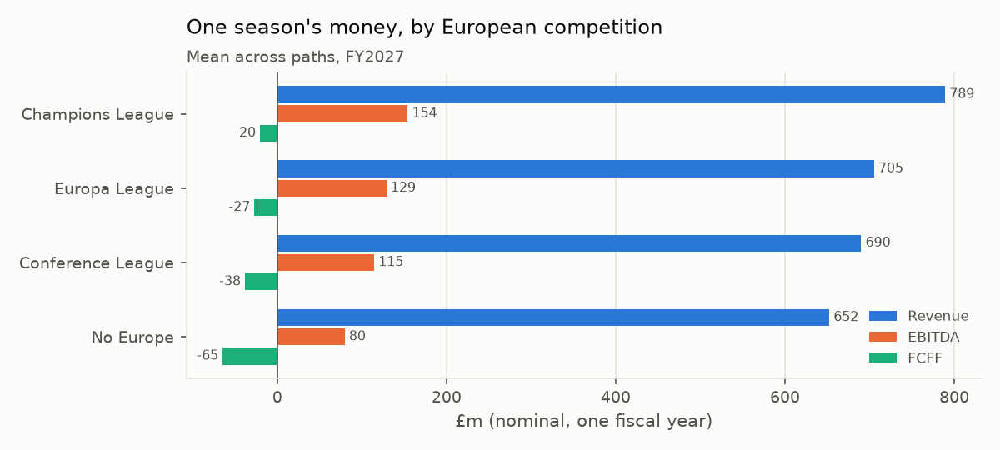
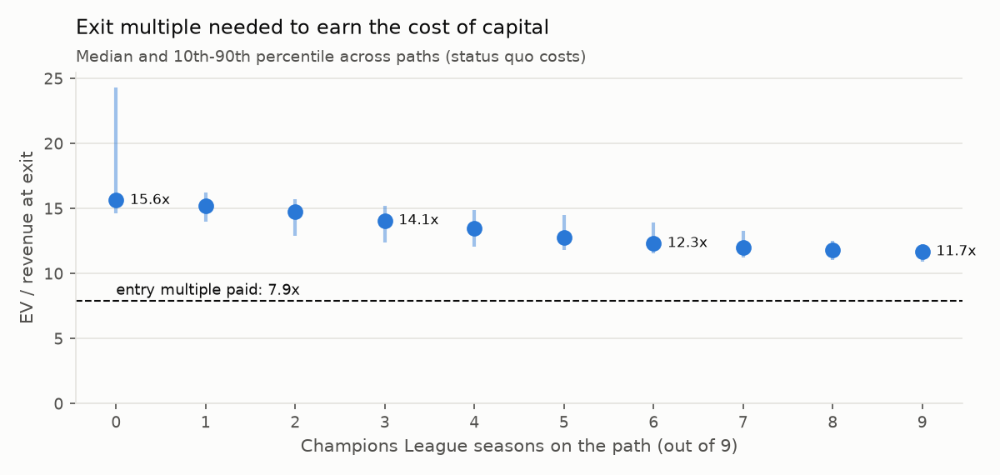

# Manchester United: Monte Carlo valuation driven by on-pitch results

Valuation date **2024-02-20** (INEOS completion). 10,000 paths × 10 seasons (2023-24 to 2032-33). Base financial year: **FY2023**, the last annual report published before the valuation date.

> **Financials come from the bundled snapshot** (`data/manu_financials_snapshot.csv`, rounded figures from the annual reports). Run `python scripts/fetch_edgar.py` to rebuild them from SEC EDGAR XBRL and re-run.

## The answer

* **Price.** $33/share × 163.5m shares at $1.27/£ = £4.2bn equity; plus net debt £575m and net transfer payables £300m = **£5.1bn enterprise value**, or **7.9x** trailing revenue (FY2023).
* **Cash flows alone do not get there.** Status quo median intrinsic EV −£566m (5th-95th percentile −£1.2bn to −£128m). The INEOS price sits **above all 10,000 simulated paths**, and above every path in all three scenarios (best case: £1.5bn at the 95th percentile of *Plan + growth*). The gap to the price is what the buyer pays for something other than the club's own cash flows.
* **Why:** United's cash conversion. Adjusted EBITDA is about a fifth of revenue and the squad costs almost as much again in net transfer spend, so free cash flow is close to zero before any on-pitch upside.
* **The implied bet** is therefore on the *exit*, not on the dividends. Buying at 7.9x and selling in FY2033 at the same multiple returns a median **2.6% IRR** (status quo), against an 8.6% cost of capital. Earning the cost of capital needs an exit at about **13.3x** revenue: the bet is that football's scarcity premium keeps expanding.
* **On the pitch, the price needs the Champions League habit back.** With costs as they were, even a United that plays Champions League football 90% of the time only lifts the IRR to 4.4%. Only the cost plan *plus* faster growth *plus* regular Champions League football gets close (7.7%). No combination tested clears 8.6% without a rising multiple.

## Scenarios

Same 10,000 sporting paths each time; only the business assumptions change.

* **Status quo:** Cost base and player spending as in the base year
* **INEOS cost plan:** 2024-25 restructuring (c.250 roles cut, ~20% of other opex) and player spend held to 15% of revenue
* **Plan + growth:** Cost plan, plus commercial growth of 6% and PL rights growth of 5% a year

| scenario        | EV p5   | EV median   | EV p95   | EV mean   | INEOS price percentile   | P(top 4)   | P(UCL season)   | IRR at entry multiple (median)   | P(IRR ≥ WACC)   | exit multiple for WACC   |
|:----------------|:--------|:------------|:---------|:----------|:-------------------------|:-----------|:----------------|:---------------------------------|:----------------|:-------------------------|
| Status quo      | −£1.2bn | −£566m      | −£128m   | −£614m    | 100%                     | 41%        | 47%             | 2.6%                             | 0%              | 13.3x                    |
| INEOS cost plan | −£301m  | £317m       | £672m    | £264m     | 100%                     | 41%        | 47%             | 3.6%                             | 0%              | 12.4x                    |
| Plan + growth   | £582m   | £1.2bn      | £1.5bn   | £1.1bn    | 100%                     | 41%        | 47%             | 6.2%                             | 0%              | 9.9x                     |

## 1. Sporting model

**Elo** on every Premier League match since 2010-11 (openfootball). K = 16 and season carry-over = 0.9 were picked by log loss (0.9709 vs 1.0646 for base rates). An ordered logit on the rating gap turns ratings into win/draw/loss probabilities (P(home win) at equal ratings 44.0%, draw 27.2%).

**Season strength and its dynamics.** Each team-season gets a strength (Elo points vs the league average) fitted to that season's results. A Kalman-filtered state-space model (club *level* that drifts + *form* that fades) is fitted to those by maximum likelihood across all clubs:

| parameter | estimate |
|---|---|
| level drift per season (sd) | 32.5 |
| form shock (sd) | 24.7 |
| form persistence ρ | -0.14 (≈ 0: last season's luck does not carry over) |
| newly promoted club, mean level | -111 |
| United's filtered level after the last completed season | 116 |

Most of the season-to-season movement is permanent (level), not noise that reverts. This matters: a bad United season is partly news about the future, not just bad luck.

**Each simulated season** plays all 380 fixtures; relegated clubs are replaced by promoted ones (United can go down and come back). Qualification follows the English rules (top 4 to the UCL, a 5th place half the time through UEFA's performance spot, FA Cup winner to the UEL). European runs are simulated round by round, tilted by United's strength that season.

**Does it forecast?** Every season from 2012-13 to 2025-26 was forecast before a ball was kicked, with the dynamics fitted only on earlier seasons:

| event     |   brier |   climatology |   skill |
|:----------|--------:|--------------:|--------:|
| top 4     |   0.081 |         0.160 |   0.495 |
| relegated |   0.103 |         0.127 |   0.191 |

Skill = 1 − Brier / Brier of always predicting the base rate.

## 2. From results to revenue

The base year is reproduced exactly: each revenue line is split into a part driven by that year's results (league merit payments, UEFA money, European gates, sponsor clauses) and a calibrated core.

| line         |   reported | sporting-driven part                    |   calibrated core |
|:-------------|-----------:|:----------------------------------------|------------------:|
| Broadcasting |      215.2 | PL central 159.6 (finish 3) + UEFA 15.7 |              39.9 |
| Matchday     |      130.4 | European gates 24.5                     |             105.9 |
| Commercial   |      302.8 | kit penalty 0.0, UCL bonus x1.00        |             302.8 |
| Wages        |      331.4 | UEFA bonuses 1.6, UCL clause on         |             376.9 |
| Other opex   |      174.3 | revenue - wages - adjusted EBITDA       |             174.3 |

Sporting links in the projection:

* **League finish → PL merit payment** (~£2.8m a place) and relegation (parachute payment, commercial and matchday hits, relegation wage cuts).
* **Previous finish → European competition → UEFA prize money** (starting fee, results, value pillar, knockout bonuses) **and extra home gates**.
* **Kit deal clause:** -30% of the £90m adidas fee after two consecutive seasons without the Champions League.
* **Wages hedge part of it:** senior contracts lose ~25% without the Champions League (assumed to cover 50% of the bill), and 10% of UEFA money goes out as bonuses.

| competition       |   revenue |   ebitda |   fcff |   wages |   uefa |
|:------------------|----------:|---------:|-------:|--------:|-------:|
| Champions League  |       789 |      154 |    -20 |     439 |     62 |
| Europa League     |       705 |      129 |    -27 |     380 |     15 |
| Conference League |       690 |      115 |    -38 |     379 |      8 |
| No Europe         |       652 |       80 |    -65 |     376 |      0 |

Champions League vs no Europe: +£137m revenue but only +£75m EBITDA, because wage clauses give a large part of the upside back to the players.

## 3. Cash flow and DCF

FCFF = adjusted EBITDA − tax (25%, losses carried forward) − net player-registration spend − PP&E capex. Net player spend = 18.1% of revenue in the status quo (base-year amortisation less typical player-sale profits). WACC 8.64% (Rf 4.1%, ERP 5.0%, β 1.0, Kd 7% pre-tax, D/V 12%); terminal growth 2.5% on the average FCFF of the last 5 years, so one lucky final season does not set the perpetuity.

Mean projection, status quo (£m):

| £m           |   FY2024 |   FY2025 |   FY2026 |   FY2027 |   FY2028 |   FY2029 |   FY2030 |   FY2031 |   FY2032 |   FY2033 |
|:-------------|---------:|---------:|---------:|---------:|---------:|---------:|---------:|---------:|---------:|---------:|
| revenue      |      692 |      697 |      714 |      734 |      754 |      774 |      796 |      820 |      843 |      868 |
| broadcasting |      240 |      233 |      244 |      249 |      254 |      259 |      265 |      272 |      277 |      284 |
| matchday     |      130 |      136 |      138 |      141 |      145 |      148 |      152 |      157 |      161 |      165 |
| commercial   |      323 |      328 |      332 |      344 |      355 |      367 |      379 |      392 |      405 |      419 |
| wages        |      394 |      375 |      397 |      409 |      422 |      435 |      449 |      464 |      479 |      494 |
| other_opex   |      180 |      185 |      190 |      196 |      202 |      208 |      214 |      221 |      227 |      234 |
| ebitda       |      118 |      137 |      127 |      129 |      130 |      131 |      133 |      135 |      137 |      139 |
| player_capex |      126 |      126 |      129 |      133 |      137 |      140 |      144 |      149 |      153 |      157 |
| ppe_capex    |       28 |       28 |       29 |       29 |       30 |       31 |       32 |       33 |       34 |       35 |
| tax          |        0 |        0 |        0 |        0 |        0 |        0 |        0 |        0 |        0 |        0 |
| fcff         |      -35 |      -17 |      -31 |      -33 |      -37 |      -40 |      -43 |      -46 |      -50 |      -53 |

## 4. Sensitivity: how good do United need to be?

United's starting level is forced to each value and the whole simulation re-run (2,000 paths each). *Level* is Elo points above the league average; the model's own estimate at the deal date, after 25 games of 2023-24, was 111.

**Status quo**

|   level | P(top 4)   | P(UCL season)   | median EV   | median IRR   | exit multiple for WACC   |
|--------:|:-----------|:----------------|:------------|:-------------|:-------------------------|
|       0 | 10%        | 16%             | −£1.1bn     | 0.8%         | 15.4x                    |
|      50 | 22%        | 28%             | −£839m      | 1.4%         | 14.6x                    |
|     100 | 37%        | 44%             | −£611m      | 2.3%         | 13.7x                    |
|     150 | 57%        | 61%             | −£417m      | 3.4%         | 12.5x                    |
|     200 | 75%        | 76%             | −£274m      | 3.9%         | 12.0x                    |
|     250 | 87%        | 84%             | −£169m      | 4.2%         | 11.7x                    |
|     300 | 94%        | 90%             | −£58m       | 4.4%         | 11.4x                    |

**INEOS cost plan**

|   level | P(top 4)   | P(UCL season)   | median EV   | median IRR   | exit multiple for WACC   |
|--------:|:-----------|:----------------|:------------|:-------------|:-------------------------|
|       0 | 10%        | 16%             | −£157m      | 1.9%         | 14.3x                    |
|      50 | 22%        | 28%             | £92m        | 2.5%         | 13.6x                    |
|     100 | 37%        | 44%             | £282m       | 3.3%         | 12.7x                    |
|     150 | 57%        | 61%             | £439m       | 4.4%         | 11.6x                    |
|     200 | 75%        | 76%             | £555m       | 4.8%         | 11.2x                    |
|     250 | 87%        | 84%             | £640m       | 5.1%         | 10.9x                    |
|     300 | 94%        | 90%             | £731m       | 5.3%         | 10.7x                    |

**Plan + growth**

|   level | P(top 4)   | P(UCL season)   | median EV   | median IRR   | exit multiple for WACC   |
|--------:|:-----------|:----------------|:------------|:-------------|:-------------------------|
|       0 | 10%        | 16%             | £718m       | 4.7%         | 11.3x                    |
|      50 | 22%        | 28%             | £942m       | 5.2%         | 10.8x                    |
|     100 | 37%        | 44%             | £1.1bn      | 6.0%         | 10.1x                    |
|     150 | 57%        | 61%             | £1.3bn      | 6.9%         | 9.3x                     |
|     200 | 75%        | 76%             | £1.4bn      | 7.3%         | 9.0x                     |
|     250 | 87%        | 84%             | £1.5bn      | 7.5%         | 8.8x                     |
|     300 | 94%        | 90%             | £1.6bn      | 7.7%         | 8.6x                     |

## 5. Reality check: what happened after the deal

United's actual finishes against the distribution simulated on 20 February 2024:

| season   |   actual | p_exact   | p_this_or_worse   | p_top4   |   median |
|:---------|---------:|:----------|:------------------|:---------|---------:|
| 2023-24  |        8 | 3.3%      | 5.0%              | 21.4%    |     5.00 |
| 2024-25  |       15 | 0.5%      | 1.2%              | 45.1%    |     5.00 |
| 2025-26  |        3 | 13.3%     | 85.4%             | 43.5%    |     5.00 |

Reported revenue against the simulated distribution (status quo):

| fy     |   actual |   model_p5 |   model_p50 |   model_p95 |   actual_percentile |
|:-------|---------:|-----------:|------------:|------------:|--------------------:|
| FY2024 |   661.80 |     687.95 |      693.55 |      696.35 |                0.00 |
| FY2025 |   666.50 |     644.64 |      684.11 |      764.46 |                0.18 |

The model ran hot on revenue in the first years after the deal: commercial income was flat in FY2024 (the model grows it 3.5% a year plus a Champions League uplift), and the old-format group stage paid less than the 2024-27 tariffs assumed here. Both errors flatter the valuation, so they strengthen the conclusion rather than weaken it.

**Re-run as of 2026-09-21** (same code, all results to date, base year FY2025):

| scenario        | ev_at_deal   | ev_now   | p_ucl_at_deal   | p_ucl_now   |
|:----------------|:-------------|:---------|:----------------|:------------|
| Status quo      | −£566m       | −£440m   | 47%             | 25%         |
| INEOS cost plan | £317m        | £764m    | 47%             | 25%         |

Values are at different dates (and the later run is calibrated to FY2025 costs, after the first INEOS cuts), so compare the sporting columns more than the money.

United's filtered level: 116 at the deal, 69 now.

## Limitations

* **Strength is free.** The sweep treats a better United as costless. In reality strength is bought with wages and transfers, so the IRR gains in section 4 are an upper bound.
* **Tariffs are approximations** (UEFA 2024-27 cycle, PL 2023-24 distribution). Calibration to the base year absorbs level errors but not the *size* of the sporting swings.
* **Sponsor clauses beyond the kit deal are not public.** The kit penalty, the UCL pay-cut share and the player-sale profit ratio are assumptions (see `manu_valuation/config.py`).
* **Not modelled:** the proposed new stadium (a large capex *and* matchday bet), Old Trafford regeneration funding, working capital, FX on USD debt, and changes to European competition formats.
* **One league's history.** The dynamics are fitted on Premier League seasons since 2010-11 (260 team-seasons).

## Data

* Results: `data/epl_matches.csv` (openfootball, public domain), 5,320 fixtures known at the valuation date.
* Financials: `data/manu_financials_snapshot.csv`.
* Every assumption, with its source: `manu_valuation/config.py`.
