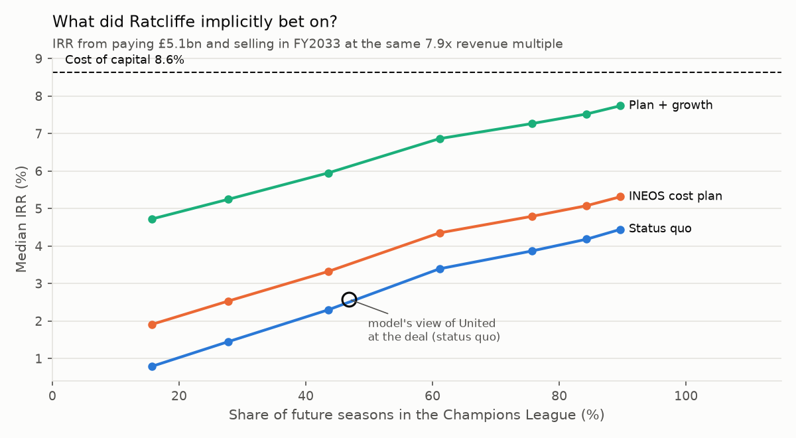
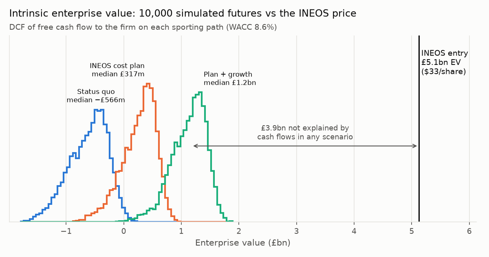

# Manchester United: a Monte Carlo valuation driven by on-pitch results

A normal DCF gives one number and treats revenue as a smooth trend. A football club's
revenue depends on a random sporting outcome. League position sets prize money and broadcast
share. It decides Champions League qualification, which moves revenue by well over £100m a
season. It also triggers sponsor and wage clauses. This engine simulates the results first
and lets the cash flows follow.

**Question:** *What did Sir Jim Ratcliffe implicitly bet on when INEOS paid $33 a share in
February 2024?*





Full output: [`docs/valuation/report.md`](../docs/valuation/report.md). Interactive version:
[`docs/valuation/index.html`](../docs/valuation/index.html). Rebuild its data with
`python scripts/export_valuation_data.py`. It recomputes the DCF, IRR and exit multiple in the
browser, with sliders for price per share, WACC, terminal growth and exit multiple.

## Headline (as of 20 Feb 2024, 10,000 paths)

* The price is **£5.1bn enterprise value, 7.9x trailing revenue**.
* On United's actual cost base, **intrinsic value is around zero**. Adjusted EBITDA is about
  a fifth of revenue, and net transfer spend takes most of that, so free cash flow is roughly
  nil before any on-pitch upside. The INEOS price sits above every one of 10,000 simulated
  paths in every scenario.
* The bet is on the **exit multiple**. Buying at 7.9x and selling ten years later at the same
  multiple returns a median **~2.6% IRR**, against an **8.6% cost of capital**. Earning the
  cost of capital needs an exit at **~13x revenue**.
* **On the pitch**, going from Champions League football in 16% of seasons to 90% adds about
  £1bn of intrinsic value, but even then the IRR stays below the cost of capital. The cost
  plan, faster revenue growth *and* a near-permanent Champions League place together get
  close (7.7%). Nothing tested clears it without the multiple rising.
* **Wage clauses are a natural hedge.** Champions League vs no Europe is worth about +£137m
  revenue but only about +£75m EBITDA.

## Pipeline

```
openfootball results ──> Elo (K, carry-over by log loss) ──> ordered-logit W/D/L link
        │                                                         │
        └──> season strength per team-season (penalised MLE) <────┘
                    │
                    └──> Kalman state-space model: level (drifts) + form (fades), MLE across clubs
                                    │
SEC EDGAR XBRL ──> financials       └──> 10,000 × 10-season paths: 380 fixtures a season,
(companyfacts + 20-F instances)          promotion/relegation, UEFA places, FA Cup, European runs
        │                                          │
        └──> base-year calibration ──> revenue mapping ──> P&L ──> FCFF ──> DCF / IRR / exit multiple
```

| step | module | what it does |
|---|---|---|
| 1. Data | `edgar.py`, `scripts/fetch_edgar.py` | Man Utd plc (CIK 1549107) files a 20-F under IFRS. `companyfacts` gives the undimensioned facts: revenue, wages, amortisation, depreciation, borrowings and cash. The matchday/broadcasting/commercial split is dimensional, so it is parsed from each 20-F's XBRL instance. |
| | `results.py` | Every Premier League fixture since 2010-11 from openfootball (public domain), cached in `data/epl_matches.csv`. |
| 2. Sporting model | `elo.py` | Goal-difference Elo. K and between-season carry-over are chosen by log loss. An ordered logit on the rating gap gives win/draw/loss probabilities (log loss 0.971 vs 1.065 for base rates). |
| | `sporting.py` | One strength per team-season, fitted to that season's results. A state-space model (drifting club *level* + fading *form* + measurement error) is fitted with a vectorised Kalman filter by maximum likelihood; it nests "fixed club mean + AR(1)". Also the league and European simulators. |
| | `engine.py` | Paths from the valuation date. The season in progress is conditioned on the table so far (Bayesian update of every club's strength). Future seasons play all 380 fixtures. Relegated clubs are replaced by promoted ones, and United can go down. Qualification uses English rules, including the European Performance Spot and FA Cup/UEL-winner routes. Europe is simulated round by round. Nothing after the valuation date leaks in. |
| 3. Revenue mapping | `finance.py` | PL merit payments by finish, parachute payments, UEFA prize money (2024-27 tariffs: starting fee, stage bonuses, value pillar), European home gates, the kit-deal penalty after two seasons without the UCL, UCL sponsor bonuses, the UCL wage clause and UEFA bonus pool. The base year is reproduced exactly through calibrated "core" lines. |
| 4. Simulation → DCF | `finance.py`, `valuation.py` | FCFF = EBITDA − tax (losses carried forward) − net player capex − PP&E capex. Mid-year discounting, a stub for the part-season, and a terminal value on a 5-year average FCFF. Also the buyer's IRR at a given exit multiple and the exit multiple that earns the WACC. |
| 5. Output | `run_valuation.py` | Report, charts, three business scenarios and a sweep over United's strength. Reality checks cover the finishes and revenue that actually followed, an out-of-sample backtest of pre-season forecasts, and a re-run as of today. |

All assumptions, with their sources, are in [`config.py`](config.py).

## Run it

```bash
pip install -r requirements.txt

# optional: rebuild the financials from EDGAR (the SEC wants a name + e-mail as User-Agent)
python scripts/fetch_edgar.py --user-agent "Your Name you@example.com"

python run_valuation.py --out docs/valuation      # ~1 minute
python run_valuation.py --quick --paths 2000      # smoke run
python run_valuation.py --as-of 2026-09-21        # value it today instead
pytest
```

Without `data/manu_financials.csv` the engine uses `data/manu_financials_snapshot.csv`. That
file holds rounded figures from the annual reports, and the report flags when it is in use.
EDGAR was not reachable from the environment this was built in, so the XBRL parser is tested
against a synthetic 20-F instance but not yet against a live filing. Run `fetch_edgar.py
--dump` first if the revenue split comes back empty. It lists the concepts and dimension
members EDGAR returned.

## Validation

* **Backtest.** Every season from 2012-13 to 2025-26 was forecast before kick-off, with the
  dynamics fitted only on earlier seasons. Top-4 Brier skill is 0.50 and relegation skill is
  0.19 against climatology, and the forecasts are well calibrated (`backtest_calibration.png`).
* **Base-year identity.** Projecting the base year's actual sporting outcomes reproduces every
  reported line (`tests/test_valuation.py`).
* **Reality check.** From 20 Feb 2024 the model gave United's 8th place in 2023-24 a 5% chance
  (that or worse), the 15th in 2024-25 1.2%, and the 3rd in 2025-26 85% (that or worse). It
  was also ~5% too high on FY2024 revenue. Both misses make the price look *more* supportable
  than it was, so they do not change the conclusion.

## Limitations

* **Strength is free.** The strength sweep treats a better United as costless; really it
  costs wages and transfer fees, so those IRR gains are an upper bound.
* **Approximate inputs.** Tariffs are approximate. Kit-deal and pay-cut clauses are reported,
  not published. Net debt and transfer payables at the deal are estimates (`config.Deal`).
* **Not modelled:** the new-stadium plan, working capital, and FX on the dollar debt.
* **Only one exit multiple.** The IRR lens is enterprise-level. It does not model the INEOS
  minority structure, drag/tag rights or the $300m infrastructure commitment.

## Talking points

1. **Why simulate?** Revenue is a function of a random league table. Show `ucl_economics.png`:
   the Champions League cliff, and how wage clauses give half of it back.
2. **Is the sporting model any good?** The Elo link, the state-space dynamics and the
   out-of-sample calibration plot. Mention that most season-to-season movement is permanent,
   so a bad season is news and not just noise.
3. **The distribution vs the price.** The price sits beyond every path. Why the cash
   conversion (EBITDA minus net transfer spend) is the binding constraint, not revenue.
4. **The bet.** At a constant multiple the IRR is below the WACC, whatever happens on the
   pitch. The price is a call on football's scarcity premium re-rating further, with
   sporting success deciding how much re-rating is needed (15x with no Champions League
   seasons, about 12x with nearly all of them).
